# 🛠️ ToolBox App

[](https://flutter.dev/)
[](https://dart.dev/)
[]()

Una aplicación móvil moderna construida con **Flutter** que integra múltiples herramientas de utilidad, predicción de datos y noticias en tiempo real mediante el consumo de diversas **APIs REST**.

---

## 📸 Screenshots (Bento Design)

| Pantalla | Dark Mode | Light Mode |
| :--- | :---: | :---: |
| **Dashboard** | 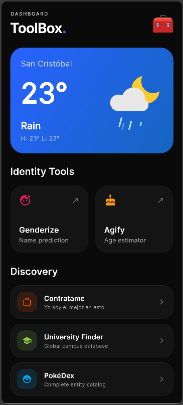 | 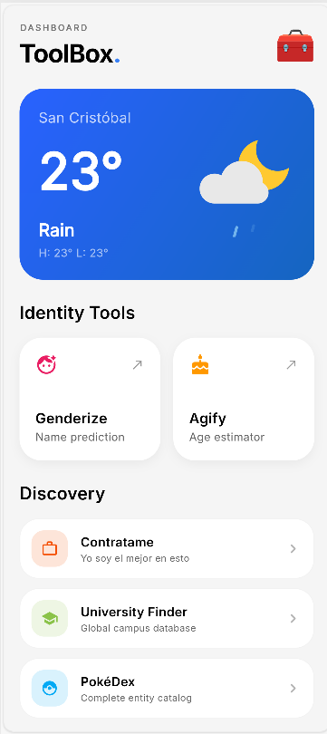 |
| **Identity: Gender** | 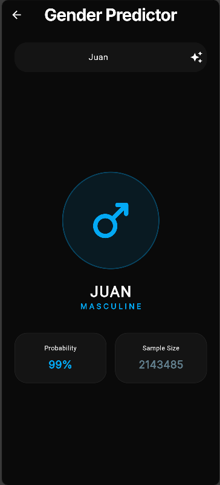 | 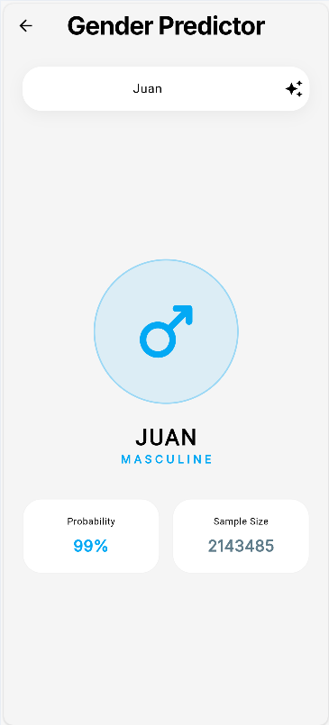 |
| **Identity: Age** | 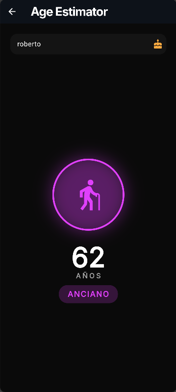 | 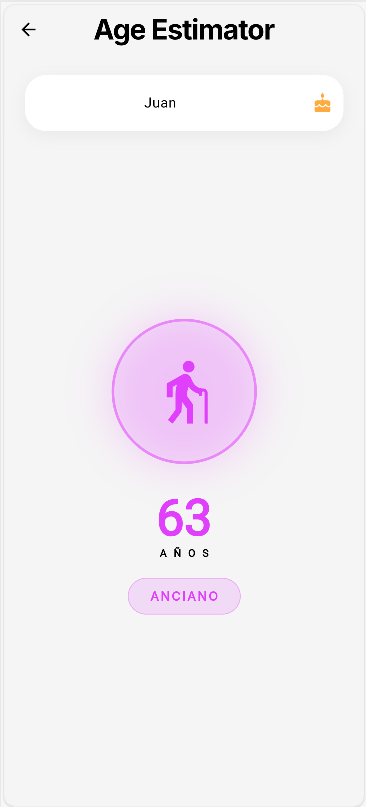 |
| **Discovery: PokéDex** | 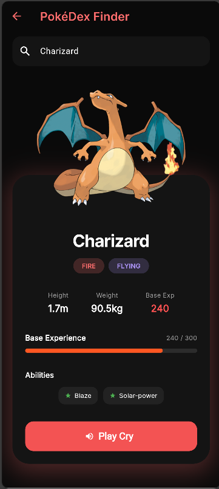 | 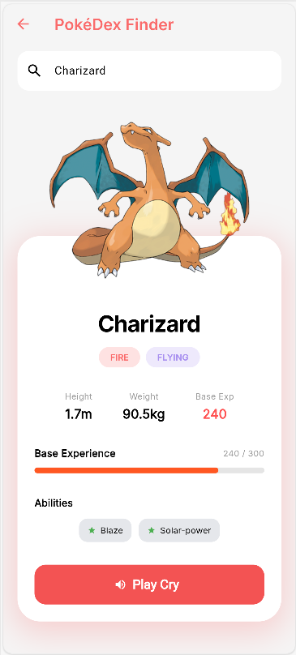 |
| **Discovery: Universities**|  |  |
| **News Feed** | 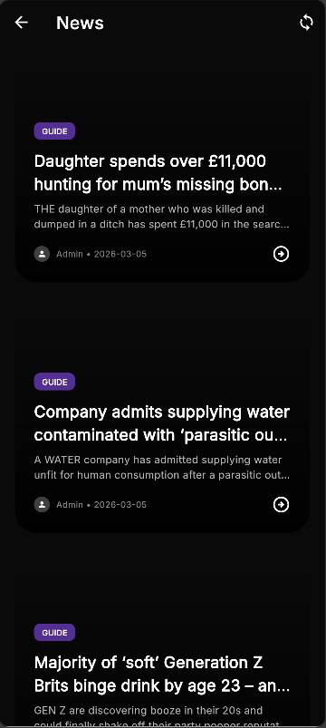 | 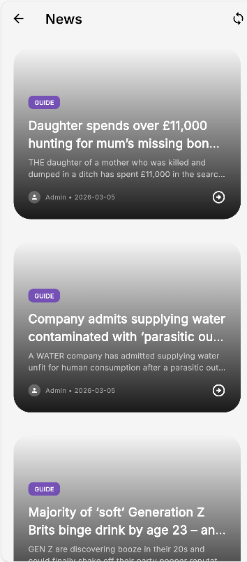 |
| **News Detail** |  |  |
| **Hire Me (Contrátame)** | 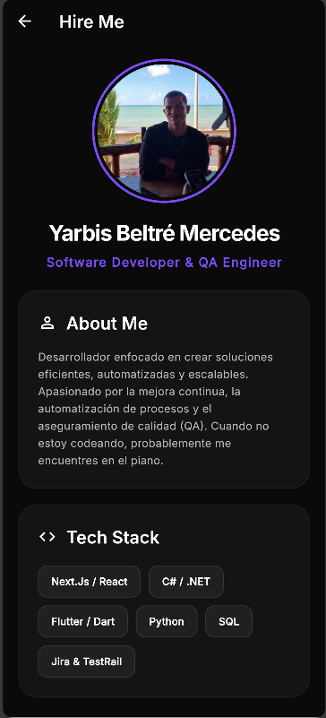 | 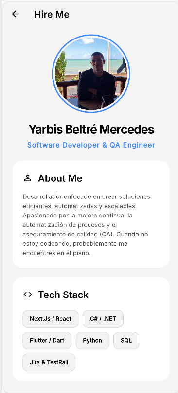 |

---

## 🌟 Características Principales

### 🆔 Identity Tools (Predicciones)
* **Genderize**: Predicción del género basada en el nombre del usuario mediante la API de Genderize.
* **Agify**: Estimación de la edad promedio basada en análisis de datos de nombres históricos.

### 🔍 Discovery & Utilities
* **University Finder**: Búsqueda global de instituciones educativas filtradas por país.
* **PokéDex**: Catálogo completo de entidades Pokémon con estadísticas, habilidades y sprites oficiales.
* **Live Weather**: Información climática en tiempo real basada en la geolocalización actual del usuario (GPS), con animaciones Lottie inmersivas.

### 📰 News
* **WordPress Integration**: Feed dinámico de noticias consumido directamente desde la API REST de WordPress, con soporte para imágenes destacadas, renderizado HTML limpio y metadatos de autores.

---

## 🎨 Diseño y UI
La aplicación utiliza una estética **Bento Grid** minimalista con las siguientes capacidades:
* **Tema Adaptativo**: Soporte completo y automático para modo claro y oscuro, respetando las preferencias del sistema del usuario.
* **Componentes Dinámicos**: Widgets reutilizables (`QuickActionCard`, `DiscoveryTile`, `WeatherCard`) que ajustan sus gradientes, sombras y colores base según la paleta del tema activo.
* **Jerarquía Visual**: Uso de colores neón como acentos sobre fondos de alto contraste para guiar la atención del usuario hacia las herramientas clave.

---

## 🚀 Tecnologías y APIs

| Módulo | Tecnología / Herramienta |
| :--- | :--- |
| **Framework Base** | Flutter (Dart) |
| **Datos Climáticos** | OpenWeatherMap API |
| **Feed de Noticias** | WordPress REST API v2 |
| **Geolocalización** | `geolocator` Package |
| **Animaciones & UI** | Lottie Animations, `flutter_svg`, `flutter_html` |

---

## 📁 Arquitectura del Proyecto

El código sigue una estructura limpia para separar la lógica de negocio de la interfaz de usuario:
* `/models`: Clases de datos (Weather, WpPost, AgeModel, etc.) con sus respectivos `fromJson`.
* `/services`: Clases responsables de las peticiones HTTP y manejo de APIs externas.
* `/ui/screens`: Pantallas principales de la aplicación.
* `/ui/widgets`: Componentes visuales modulares y reutilizables.

---

## 🛠️ Instalación y Configuración

### Prerrequisitos
* Flutter SDK instalado en tu máquina.
* Un emulador o dispositivo físico conectado.
* Una API Key gratuita de [OpenWeatherMap](https://openweathermap.org/).

### Pasos
1. **Clonar el repositorio**:
   ```
   git clone [https://github.com/tu-usuario/coteau_v2.git](https://github.com/tu-usuario/coteau_v2.git)
   ```

2. **Acceder al directorio:**
```
cd coteau_v2
```
3. **Instalar dependencias:**
```
flutter pub get
```
4. **Configurar Variables de Entorno:**

Crea un archivo llamado .env en la raíz del proyecto y añade tu clave de OpenWeather:

```
OPENWEATHER_API_KEY=tu_clave_aqui
```
5. **Ejecutar la aplicación:**
```
flutter run
```

---


<div align="center">
  
  
  ### Yarbis Beltré Mercedes
  **Software Developer & QA Engineer**

  Desarrollador enfocado en crear soluciones eficientes, automatizadas y escalables. Apasionado por la mejora continua, la automatización de procesos y el aseguramiento de calidad (QA). Cuando no estoy codeando, probablemente me encuentres en el piano. 🎹

  <br/>

  [](mailto:yarbisbeme@gmail.com)
  [](https://do.linkedin.com/in/yarbis-beltre-mercedes)
  []([github.com/tu-usuario](https://github.com/Yarbisbeme))
</div>